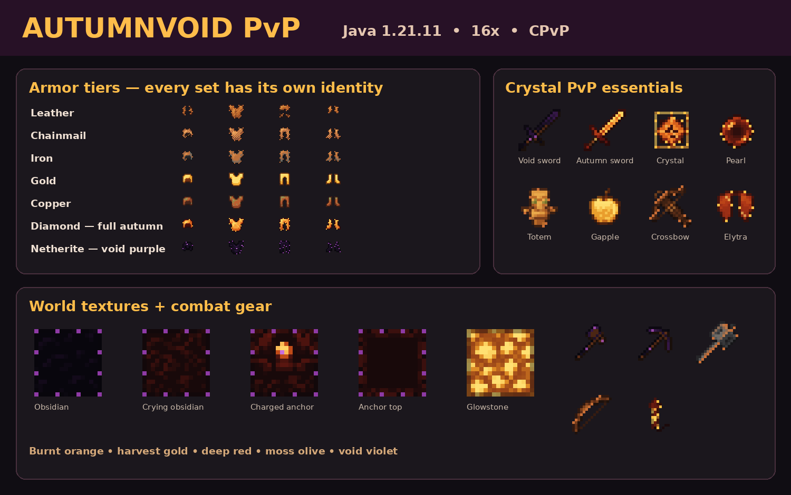

# AutumnVoid PvP

A **16x Minecraft Java 1.21.11 resource pack** made for crystal PvP.

[Download the install-ready ZIP](https://github.com/nailmc38-commits/AutumnVoid-PvP/raw/refs/heads/main/release/AutumnVoid-PvP-1.0.0.zip)



## Download and install

1. Use the download link above to get `AutumnVoid-PvP-1.0.0.zip`.
2. In Minecraft, open **Options → Resource Packs → Open Pack Folder**.
3. Put the ZIP in that folder. Do not unzip it.
4. Return to Minecraft and enable **AutumnVoid PvP**.

## Included textures

- Every full armor tier: leather, chainmail, iron, gold, copper, diamond, and netherite
- Matching worn armor textures, not only inventory icons
- Fully autumn diamond armor and tools
- Void-purple netherite armor and tools
- Obsidian, crying obsidian, all respawn-anchor charge states, and glowstone
- End crystals, ender pearls, totems, golden apples, XP bottles, and fireworks
- Sword, axe, pickaxe, mace, bow, crossbow, shield, and arrow textures
- Elytra item, broken elytra, and worn elytra wings
- Warm gold/orange enchantment glint

No OptiFine or mods are required.

## Rebuilding the textures

The included generator targets the official Minecraft Java 1.21.11 client jar:

```bash
python tools/generate_textures.py --client-jar path/to/1.21.11.jar --output .
python tools/build_release.py --root .
python tools/verify_pack.py release/AutumnVoid-PvP-1.0.0.zip
```

Use Python 3.12 or newer and run `python -m pip install -r requirements.txt`
before generating or validating textures. The ready-to-use ZIP does not require Python.

## Validation

The build checks the archive root, required textures, PNG validity, and resource
pack metadata. The included textures use the vanilla models and UV layouts;
this is a texture replacement pack, not a custom-geometry armor mod.
The pack has not been play-tested in a running Minecraft client here.

The metadata targets resource format 75.0 and includes `min_format` and
`max_format`, following Mojang's
[pack metadata changes](https://www.minecraft.net/en-us/article/minecraft-java-edition-1-21-9)
and the [1.21.11 resource format](https://www.minecraft.net/en-us/article/minecraft-java-edition-1-21-11).

## Notes

This fan-made resource pack is not affiliated with or endorsed by Mojang Studios or Microsoft.
